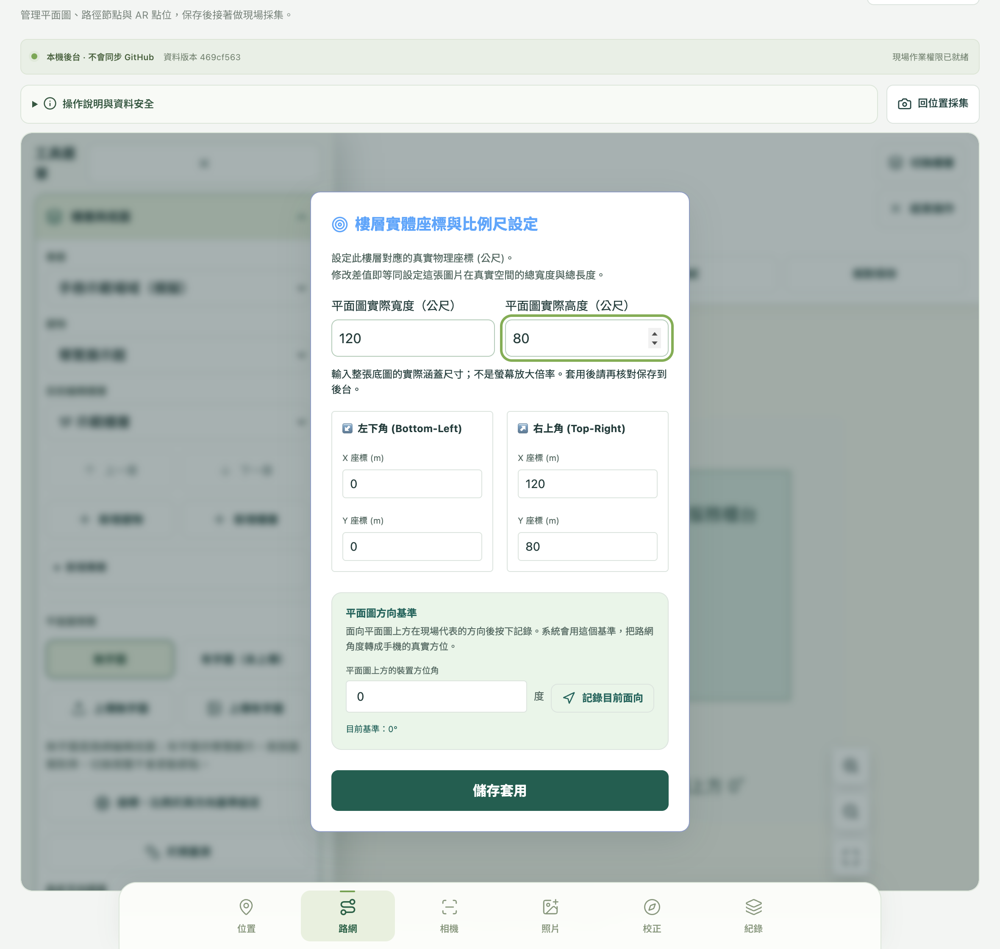
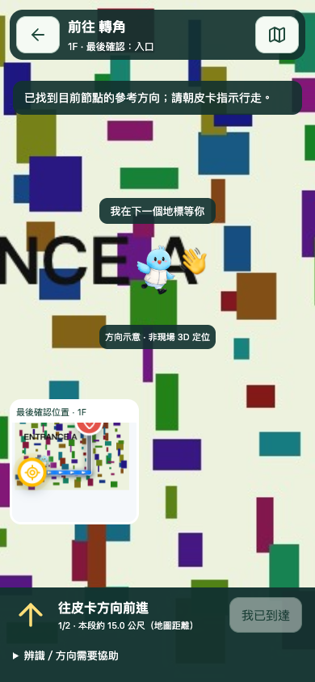
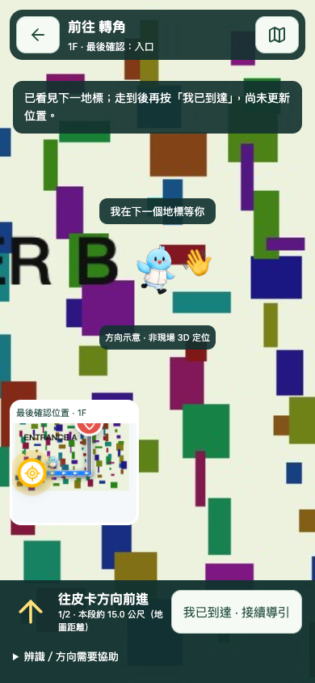
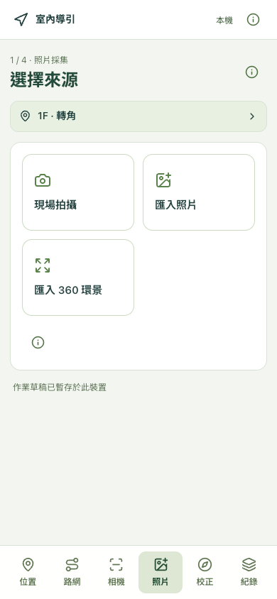
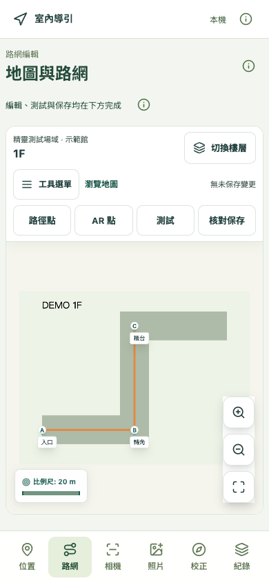
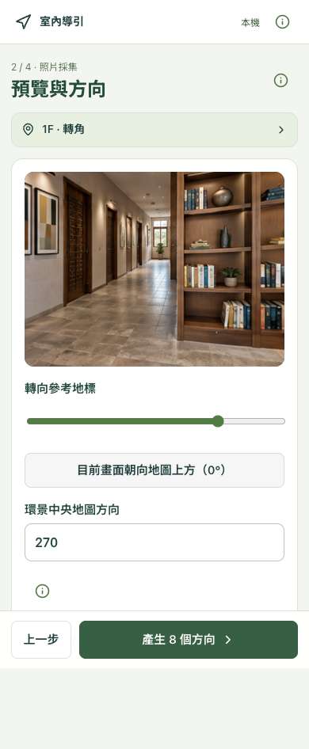
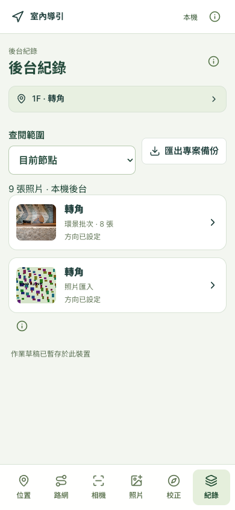

# V4 現場 AR 工作台

## 最新：民眾皮卡導引與比例尺入口

在工作台選好起點節點，開「相機 → 導航流程」即可測試；目前節點會模擬 Kiosk 位置。實際 Kiosk 的 QR Code 應指向同站 `ar-v4-navigation.html?projectId=專案ID&origin=節點ID`，參數需 URL 編碼；這次沒有替任何實體 Kiosk 修改 QR Code。沒有有效起點參數時，民眾須先選目前位置，不會猜測所在位置。

1. 選目的地後，自動開啟 V3 樣式路線預覽；預覽的「下一轉角」只查看路線，不代表人已移動。
2. 按 AR 導引，再按「開啟相機與方向感測」。拒絕方向權限仍可看圖與辨識；無方向資料時箭頭標示待校正。
3. 持續比對目前節點與下一地標的 V4 觀測照片（包括環景拆圖），並保留舊參考照片相容性。連續三幀匹配後才提出候選。
4. 皮卡以 2D 招手圖示指示下一地標；底部箭頭代替 AR 流動線，小地圖保留 V3 路線，標示「最後確認位置」。這不是 3D 空間錨定。
5. 看見下一地標不會更新位置。實際走到後按「我已到達」，才接續下一段；途中不重新開啟鏡頭。候選超過五秒未再辨識，抵達按鈕會停用。
6. 若照片缺漏或無法匹配，可展開協助，核對地圖後使用「人工確認已到此地標」，需要再次確認。方向校正只追蹤短暫轉動，不量測行走距離；顯示的公尺數是地圖路段長度。
7. 完成、離開或頁面背景化會停止鏡頭；返回路線預覽使用最後確認的節點重算。重新掃 Kiosk QR 才重新帶入該起點。

路網操作列已移除總「工具選單」按鈕和待機「瀏覽地圖」文字，改成「底圖／比例尺、路徑點、AR 點、測試、核對保存」。分類入口會開對應工具，跨樓層、匯出、復原等功能仍保留。

比例尺原本已支援左下／右上實體座標，本次新增直覺輸入：**底圖／比例尺 → 座標、比例尺與方向基準設定 → 平面圖實際寬度／高度（公尺）**。寬高是整張圖片的實際涵蓋範圍；不可填 0 或負數。按「儲存套用」只修改草稿，還要「核對保存 → 保存到本機後台」。不要以目前螢幕尺寸或縮放倍率當作實體比例尺。






這是延續 V3 的路網建置與現場採集／校正工具，不是已完成的全館自動定位導航系統。V4 的「路網」頁籤沿用既有地圖編輯器，保存到同一個本機後台後，「位置」即可讀取更新。既有 V3 頁面、原始資料檔及雲端部署不會因啟動本機工具而被覆寫。

## 三階段精靈介面（2026-09-06）

預設進入精靈介面；手機在任務開始頁顯示底部六大功能，進入步驟後改為「上一步／下一步／保存」。左上角「室內導引」隨時開啟六大功能選單，桌面則保留側邊六個入口。右上角 ⓘ 開啟說明、重新讀取與「完整工具」；原有功能沒有刪除。網址加 `?ui=classic` 可直接開完整工具。

| 功能 | 精靈操作 | 保留的進階功能 |
| --- | --- | --- |
| 位置 | 選場域樓層 → 地圖選點 → 確認位置 | 編輯建物、樓層與底圖由路網工具處理 |
| 路網 | 地圖常駐 → 選路徑點／AR 點／測試 → 核對保存 | 工具抽屜包含比例尺、跨樓層、底圖、節點詳細設定、復原、匯出及確認式清除 |
| 相機 | 選照片定位／方向提示／導航／拍攝 → 執行 → 確認 | 相機、感測器資訊藏在 ⓘ；保留匯入測試照及獨立 Demo |
| 照片 | 選來源 → 預覽與方向 → 核對保存 → 結果 | 備註、羅盤、V3 主圖取代、匯出；單張環景仰俯取景在完整工具 |
| 校正 | 選參考地標 → 微調方向 → 核對保存 → 結果 | ±1°／±5°、數值、樓層北向與明確確認 |
| 紀錄 | 選目前節點／整層 → 開啟照片或批次詳情 | 補拍、匯出該組、匯出整個專案；舊資料逐張保留 |

三階段涵蓋：共用 RWD 精靈與草稿、六項日常作業流程、紀錄整合與回歸驗證。以下舊版按鈕說明仍適用於「完整工具」，精靈以本節與下方新版環景步驟為準。

### 草稿與安全

- 自動暫存不是保存到後台。照片、環景原檔／八張批次／已確認數量、校正值與步驟依節點存於這個瀏覽器的 IndexedDB；重新開啟可恢復上次作業位置及功能。清除網站資料或裝置空間不足仍可能失去草稿，請另存原始照片。
- 環景方向未知時，不能繼續拆解；照片方向未知可留白，不會當成 0°。
- 只有按下「保存到本機後台／雲端後台」才寫入。未登入、離線、路網有未保存變更或版本衝突會阻擋寫入；後台版本與恢復的校正不同時，需再次核對。
- 「上一步」回到相機任務選擇時停止鏡頭；離開導航時移除導航框架。民眾端已接入 V4 照片候選辨識，但位置仍由使用者確認。
- 環景以新增的批次編號分組；不以時間猜測舊照片屬於哪批，也不刪除舊資料。

### 畫面示例

以下是隔離測試場域的實際新介面截圖，不是真實現場辨識成果。






## 環景批次：匯入 → 校正 0° → 自動拆解並保存

1. 在「位置」選場域／樓層 → 下一步選節點 → 確認位置。到「照片」按「匯入 360 環景」，選已拼接的 2:1 JPEG／PNG（最多 30 MB）；不支援原始 INSP／INSV。
2. 轉動「轉向參考地標」滑桿，找到面向地圖上方的地標，按「目前畫面朝向地圖上方（0°）」。也可輸入環景中央對應的地圖方向：上方 0°、右方 90°，不是地磁北方。
3. 按底部「產生 8 個方向」。每隔 45° 擷取一張水平照片，視角 75°；在核對頁檢查縮圖、節點、方向與儲存目標。
4. 按「保存到本機後台」（雲端環境顯示雲端後台）。不刪除現有照片，也不取代 V3 主圖。每節點最多 24 張，空間不足會停止。
5. 中斷後再次按保存；重新整理後可恢復同一節點的批次與已確認數量。沿用相同照片編號，不重複新增。這是逐張保存，非整批原子交易；部分已保存時不可重設該批方向。
6. 「紀錄」以一組八張呈現新批次，點開查看。到「相機 → 照片定位測試」測試，不代表已接入完整自動 AR 導航。

360 原檔只在裝置解碼及草稿暫存，不上傳後台；後台保存壓縮參考照片、取景角度、批次編號與地圖方向。請自行保管原檔，並等「作業草稿已暫存於此裝置」後再離開。本機版只保存到本機後台，Azure 預覽仍需另外發布。

### 啟動指令

```sh
cd /Volumes/MyPassport/MyWeb-v3
npm run build:ar-v4
npm run preview:ar-v4
```

- 工作台：<http://127.0.0.1:8080/ar-v4-field.html>
- 現場紀錄後台：<http://127.0.0.1:8080/admin-ar-v4.html>
- 本機後台資料：`.local/ar-v4/ar-data.json`。第一次讀取時從原始 `ar-data.json` 複製，此後獨立保存；不寫 GitHub、不讀雲端 token。
- 草稿：瀏覽器 IndexedDB，依專案／建物／樓層／節點分開保存，每節點一張待傳草稿。清除瀏覽器資料會刪除草稿；務必上傳或匯出備份。這不是完整離線 PWA，首次載入仍需後台。
- 本機伺服器僅綁定 `127.0.0.1`，不開放區網，不能在手機直接輸入電腦的區網 IP 使用。開發用 `localhost` 主機別名也不接受。

## 現場操作

介面為 App 式底部六個分頁按鈕：**位置、路網、相機、照片、校正、紀錄**，一次只顯示一個工作區。採集頁上方持續顯示目前場域／樓層／節點；點它可回到位置頁。路網頁改以編輯器自己的樓層與模式列為準，按「回位置採集」可返回選點。切換分頁保留待傳照片、環景取景參數及尚未保存的校正數值，照片分頁上的小圓點表示有待上傳草稿。

## 先建置地圖與路網

工具依工作分類成五組可折疊選單，不再靠左右滑動找按鈕。展開分類只顯示工具，不會自動進入繪圖模式；收合選單也不會取消已選模式。

| 分類 | 功能 |
| --- | --- |
| 樓層與底圖 | 選專案、建物、樓層；新增樓層；上傳與切換平面圖；比例尺及方向基準。 |
| 路徑節點 | 開始畫節點與連線、調整既有節點、設定跨樓層轉折。 |
| AR 點位 | 新增目的地、選取並編輯既有 AR 點。 |
| 路網測試 | 指定起點與終點、檢查連通、重設測試；可切換樓層指定另一端。 |
| 資料保存 | 保存到後台、重新讀取、匯出草稿；危險清除操作另行展開並確認。 |

1. 點「路網」，先看編輯器目前樓層；按「切換樓層」開啟獨立樓層面板。上傳底圖、比例尺等則在「底圖／比例尺」入口。沒有平面圖時先上傳，才可在圖上操作。
2. 展開「路徑節點」，啟用同名模式按鈕後，點地圖建立節點與連線、拖曳調整位置。編輯現有資料也可從分類中的既有節點清單選取。
3. 展開「AR 點位」，啟用新增模式或從清單選取現有點位。這些是平面圖座標，不是相機空間中的 3D 錨點。
4. 手機啟用模式後會自動收合工具，將空間留給地圖；目前模式與提示持續顯示。使用操作列的對應分類重新展開，用「結束操作」退出模式；只收合選單不會結束操作。
5. 展開「路網測試」檢查起終點連通。「完成設定」只關閉點位面板，並未寫入後台。
6. 展開「資料保存」，按「保存到本機後台」，核對確認視窗後按「確定執行」並等候成功。V4 重新讀取同一份後台資料後，按「回位置採集」，確認樓層與節點，再拍照或校正。

自動暫存只存瀏覽器，不會更新 V4 後台；「匯出草稿」可另存檔案備份。路網有未保存變更時，可切頁整理照片草稿，但場域切換與照片／校正寫入暫停，須先保存路網。上方「操作說明與資料安全」也可折疊，避免占用手機地圖空間。

移動既有節點會保留它的照片；刪除節點或樓層則會連同該位置資料移除，請先匯出備份並核對確認視窗。本機完整專案保存只更新指定專案，保留其他專案；舊資料版本會被拒絕，不提供強制覆寫。後台成功保存前會在 `.local/ar-v4/backups/` 保留前一版，復原由管理員處理，前台沒有一鍵還原功能。

本機與雲端的保存目標不同：本機不會同步 GitHub；雲端沿用既有發布確認、角色與伺服器設定，不能以本機測試當成雲端已部署。完整專案上傳上限為 24 MiB，單次現場照片／校正請求仍為 512 KiB。

## 現場採集與校正

完整工具的「相機」頁可切換「照片與方向／導航流程」；精靈則在相機任務選擇「導航流程」。內嵌獨立的 `ar-v4-navigation.html`，路線預覽沿用 V3 樣式並加入目前路段自動縮放，AR 階段改用 V4 皮卡導引。進入路線預覽及按「下一轉角」後，地圖會聚焦該段起點、途經節點與轉角；切層與畫面尺寸改變時重新計算。原 V3 網址保持原視角行為。

工作台會帶入目前專案與節點作為模擬 Kiosk 起點；選目的地即可預覽路線。V4 AR 已接入當前與下一節點的觀測照片，辨識候選後仍須由使用者確認抵達。僅使用已保存的路網與照片；未保存路網時先完成保存，才能開啟導航測試。

進入導航前會關閉採集相機；切回「照片與方向」、離開頁籤、變更場域或重新讀取資料，會卸載導航頁並結束測試，相機需重新開啟。這不會刪除照片或路網草稿，也不代表完整 V4 自動定位功能已完成。

V4 路線預覽依路段大小平順調整倍率，上限為「完整樓層圖適配畫面」的 3.5 倍。長路段最多占安全視框約 85%，短路段逐漸接近倍率上限，不會緊貼兩個相近節點過度放大；切換視角有短暫過渡（偏好減少動態效果時關閉）。地圖上的吉祥物限制在約 32px 圖框內，不隨地圖倍率放大。這是畫面縮放限制，並非固定的實體 1:N 比例尺。原 V3 不變，V4 相機改造見本手冊開頭。

相機頁提供真正的快門；拍完自動進入照片頁檢查、補註與上傳。照片頁的「前往相機拍攝」只切換回取景，不會擷取暫停的舊畫面。切到其他分頁時會停止辨識、暫停鏡頭；返回相機頁恢復取景，辨識需手動重新開始。離開／背景化網頁仍會完全關閉相機。

使用鍵盤時，底部分頁支援左右方向鍵及 Home／End。各分頁保留自己的捲動位置；底欄預留手機安全區，不需捲到頁尾才能切換功能。

1. 選專案、樓層與節點，核對地圖，站到該節點附近。
2. 按「開啟相機與方位感測」，手機直立、停下拍照。也可以匯入 JPG／PNG／WebP；匯入舊照片不會拿現在手機方位當拍攝方位。
3. 確認拍照方向：地圖上方為 0°、右方 90°、下方 180°、左方 270°。未知請留白，不會被當成 0°。
4. 「方向校正」可用滑桿、數值、±1°／±5°及相鄰路段方向，保存節點參考角度。相鄰路段只是地圖參考，必須實際面向地標。
5. 「採用拍攝時羅盤」僅在拍攝當時有有效絕對方位、且樓層地圖北向已設定時可用；相對 alpha 不能當北向。金屬干擾或未校準時用人工方向。
6. 上傳前檢查人臉、個資、機密看板及照片清晰度。預設新增 V4 觀測，不更換 V3 主圖。勾選「也設為 V3…」才會取代主要導引照片並再次確認。
7. 在「照片辨識測試」比對已保存的同樓層參考圖。相機模式需連續 3 幀匹配；可用另一張現場照片作單張測試。結果只是候選節點，需確認位置與拍攝朝向。
8. 手動確認朝向後，吉祥物固定在畫面，方向感測只短暫追蹤轉動。20 秒後、螢幕旋轉或感測來源切換後失效，需重新校正。無有效方位時不顯示動態轉向。
9. 「後台紀錄」查看保存結果；可匯出專案或未傳草稿 JSON。版本衝突時保留草稿，先重新讀取最新資料、核對節點，再重傳，不強制覆寫。

節點角度校正與每張照片的拍攝方向是不同欄位。修改節點角度不會改寫歷史照片方向。本版尚未提供已上傳觀測的修改／刪除功能；需要不同方向時新增照片，勿把所有方向照片設定成相同角度。

## 360 資料

- 用相機官方工具先拼接，匯出完整 2:1 JPG／PNG；不直接處理 `.insp`／`.insv` 或影片。
- 單檔上限 30 MB、解碼上限 1 億像素；環景至少 1024×512，超大素材請先產出較小的現場工作副本。
- 預覽可調水平角、仰俯角；輸出 768×576 的透視圖。環景「中央對應地圖方向」加上取景水平角，才得到候選拍攝方向；不知道中央方位請留白。
- 只有擷取的小圖上傳，原始環景留在操作裝置。這不是 VPS／多視點三維建圖，也不會自動得到手機 XYZ／yaw。
- 一般照片最長邊 1280，JPEG 不超過 256 KiB；每節點最多 24 筆，不會自動刪除舊照片。

## 權限與部署界線

- 本機 `ar_admin` 是僅供 loopback 的開發身分，不能當正式登入機制。Origin、Host、版本 SHA、檔案大小、JPEG 尺寸等仍會檢查。
- 正式 API 新增 `ar-field-survey-v1`，沿用 `ar_admin`、`AR_SYNC_WRITE_ENABLED`、伺服器端 GitHub 設定及 expected SHA，支援照片新增、明確主圖取代與節點／樓層校正。沒有把 token 放入前台。
- 現場用手機作業前，需要部署受保護的 HTTPS 測試站與 API，確認登入角色和資料儲存目標。本機啟動不會推送或變更 GitHub／Azure 設定；雲端可用狀態須以發佈後的部署與登入驗證為準。
- 現階段沿用既有 `ar-data.json` 資料格式；若日後啟用 GitHub 儲存，影像和備註會進入該儲存庫歷史及既有內容分發途徑。不能把機密照片、個資或內部備註當成私密上傳。正式大量採集應先改用受權限保護的媒體儲存與獨立現場資料 API，避免大 JSON 膨脹與公開素材。
- 未接入 VPS、WebSLAM、3D 模型資產或連續公尺距離追蹤。已支援 URL 帶入 Kiosk 起點，但需要另外替各機器設定正確 QR Code。

## 驗證

```sh
npm run typecheck:ar-v4
npm run test:ar-v4
npm run test:ar-v4-browser
npm run test:ar-v4-wizard
npm run test:ar-v4-public
```

瀏覽器測試只在隔離的暫存資料副本執行寫入，以合成圖片檢查壓縮／保存／辨識管線。不向 GitHub 或外部辨識平台發送照片。自比對或合成變形圖通過，只是軟體整合證据；現場不同手機、不同角度／距離、日夜光線、人潮及反光需要另外驗收。

全專案舊版 `ar.tsx`／V2 有既存 TypeScript 錯誤；V4 以獨立 `tsconfig.v4.json` 檢查，未順帶修改無關舊程式。
# 螢幕翻拍 Demo（獨立模擬資料）

開啟 `ar-v4-demo.html?mode=display`，在電腦選 0° 並放大展示；手機開同站 `ar-v4-demo.html?mode=scan`，按「開啟相機並辨識」，允許相機後對準螢幕。避免邊框及反光，讓場景占多數畫面。相機不能使用時，可用「匯入翻拍照片」。

辨識得到候選位置後，人工確認才能顯示示意路線；「模擬已抵達轉角／目的地」只是手動流程，不是移動追蹤。照片與影像留在手機，不會上傳。

「後台素材」可查看已保存的生成環景及八個參考方向。這是獨立、唯讀的版本化模擬後台，一個辨識位置，不是八個位置；沒有加入真實場域或改寫正式節點。方向相對虛構地圖軸，不是地理北方。第一次辨識會下載約 2.3 MB 環景並在瀏覽器切出參考視角。

本機瀏覽器合成正例、空白反例與流程測試已通過，實際手機翻拍仍需現場測試。生成環景不是測量資料，不能據此宣稱實景定位準確率。
